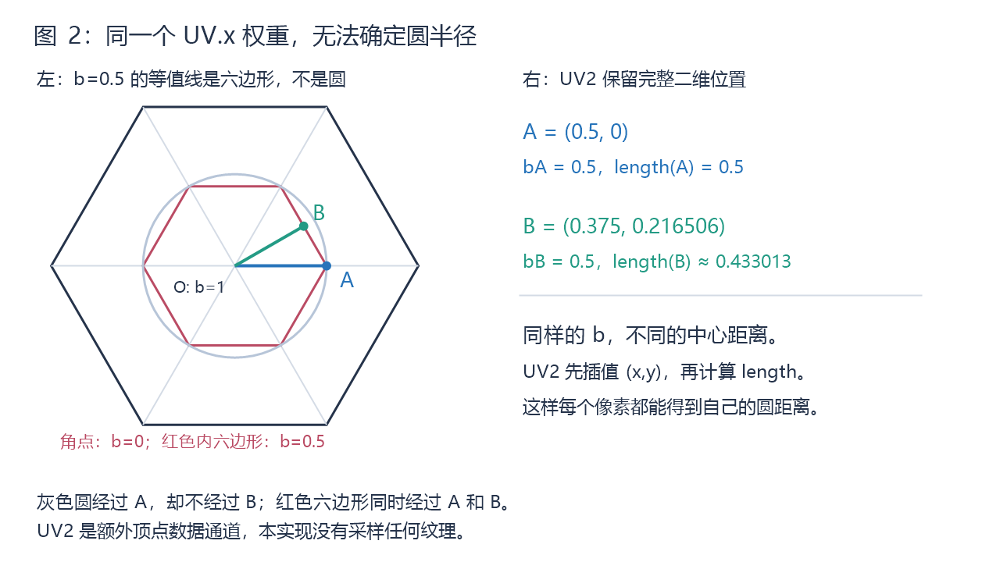
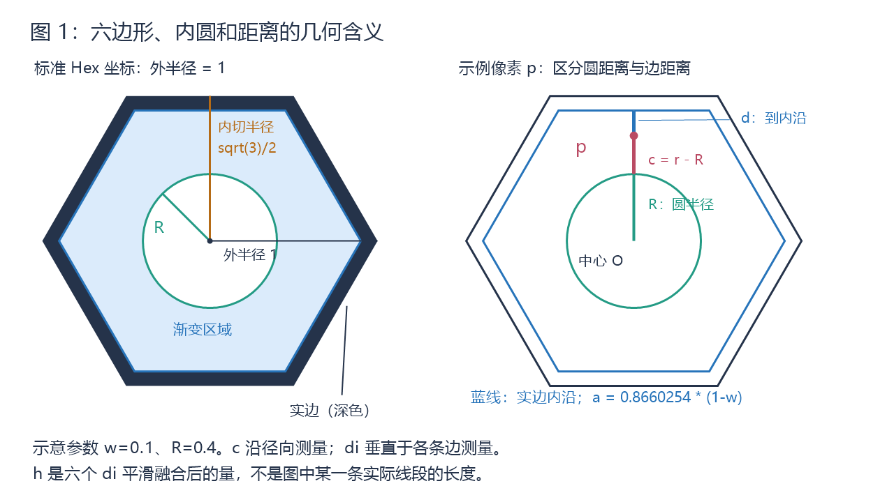
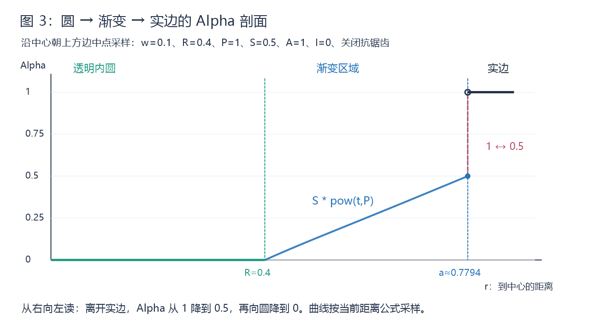

# Hex 网格实边、透明内圆与渐变 Shader 实现说明

## 目的与阅读方式

本文面向维护 `HexMap/InstancedColor` 的程序员，说明三个效果如何共同实现：清晰的六边形实边、半径可调的透明内圆，以及从实边内侧指定 Alpha 向圆渐变的区域。

每个计算步骤按“原理 → 公式 → 对应代码”展开。公式使用普通代码块，不依赖 LaTeX 或数学插件；公式中的简写与代码变量在下文一一对应。

默认理解条件：开启渐变，`_InteriorAlpha = 0`，`_BaseColor.a = 1`。先理解不带抗锯齿的结果，再看边界像素的处理。

## 代码地图

| 文件 / 符号 | 职责 |
| --- | --- |
| [InstancedColor.shader](../../Assets/HexMap/Shaders/InstancedColor.shader) / `vert` | 传递中心权重、归一化平面坐标和实例信息 |
| 同文件 / `SmoothInsetDistance` | 将六条实边内沿的距离平滑融合，避免六条内部折痕 |
| 同文件 / `frag` | 计算圆距离、渐变进度、边界遮罩和最终 Alpha |
| [HexMapRenderer.cs](../../Assets/Scripts/HexMap/UnityRuntime/HexMapRenderer.cs) / `CreateCellMesh` | 生成共享三角扇 Mesh、UV 和 UV2 |
| [HexRenderHandle.cs](../../Assets/Scripts/HexMap/UnityRuntime/HexRenderHandle.cs) / `SetAppearance` | 通过 MaterialPropertyBlock 写入每个 Cell 的颜色、边宽、渐变开关和幂次 |
| [HexMapViewTests.cs](../../Assets/Tests/EditMode/HexMap/UnityRuntime/HexMapViewTests.cs) | 验证布局顶点数据、Shader 属性和外观传递 |

项目版本为 Unity 2022.3.50f1，包配置包含 URP 14.0.11。本 Shader 声明 URP 的透明 Unlit Pass，使用 `Blend SrcAlpha OneMinusSrcAlpha`、`ZTest LEqual`、`ZWrite Off`，代码目标为 Shader Model 2.0。

本文描述具体 Shader 的当前实现；[HexMap View 渲染架构](hex-map-view-rendering.md) 是较早的目标架构文档，不作为本文 Shader 参数的定义来源。

补充说明（2026-09-20）：UV2 与 SmoothInsetDistance 的补充讲解已对照 [InstancedHexCell.shader](../../Assets/HexMap/Shaders/InstancedHexCell.shader) 核对。本文其余部分保留此前版本的记录，包括旧 Shader 名称、参数归属和抗锯齿功能；当前文件没有 `_AntiAliasing`，且 `_BorderWidth`、`_GradientPower` 位于材质常量缓冲区，不应将这些历史描述直接视为当前接口。

## 1. 整体计算流程

```text
Mesh 的 UV2 平面坐标 p
    ├─ 到内圆的距离 c ──────────────┐
    └─ 到六条实边内沿的距离 d0…d5   │
                └─ 平滑融合距离 h ──┤
                                  ↓
                        t = c / (c + h)
                                  ↓
                 渐变 Alpha = S * pow(t, P)
                                  ↓
UV 中心权重 ── 实边遮罩 B ── 混合实边与渐变
                                  ↓
                   渐变开关、内部填充、颜色 Alpha
                                  ↓
                         最终输出 Alpha
```

假设渐变起始 Alpha 为 0.5，关闭抗锯齿，沿外侧向中心移动：

```text
实边区域       |       渐变区域        |    内圆
Alpha = 1      |   0.5 → …… → 0       |  Alpha = 0
               ↑
         透明度在这里产生落差
```

## 2. 参数与公式记号

| Shader 参数 | 公式记号 | 默认值 | 含义与作用范围 |
| --- | --- | --- | --- |
| `_BaseColor` | A = 颜色的 Alpha | (1,1,1,1) | 每 Cell 属性；RGB 为输出颜色，A 缩放最终透明度 |
| `_BorderWidth` | w | 0.05 | 每 Cell 属性；实边的归一化宽度 |
| `_GradientEnabled` | E | 0 | 每 Cell 属性；0 为纯实边，1 为实边加渐变 |
| `_GradientPower` | P | 1 | 每 Cell 属性；控制渐变曲线 |
| `_GradientStartAlpha` | S | 0.5 | 材质级属性；渐变靠近实边时的相对 Alpha |
| `_InnerRadius` | R（限制后） | 0.4275 | 材质级属性；以 Hex 外半径为 1 的内圆半径 |
| `_InteriorAlpha` | I | 0 | 材质级属性；内部填充的 Alpha 下限 |
| `_AntiAliasing` | 无 | 1 | 材质级属性；是否平滑边界像素 |

本文使用的函数含义：

```text
length(p)       = sqrt(p.x*p.x + p.y*p.y)
dot(p, n)       = p.x*n.x + p.y*n.y
pow(x, P)       = x 的 P 次方
rsqrt(x)        = 1 / sqrt(x)
saturate(x)     = clamp(x, 0, 1)
lerp(a, b, t)   = a*(1-t) + b*t
step(edge, x)   = x < edge 时为 0，否则为 1
```

## 3. 网格数据：两个输入承担不同职责



图 2 中，红色小六边形上的点具有相同的中心权重 b=0.5，但并不在同一个圆上。UV2 保存的位置可以区分这些点。

### 原理

Mesh 使用中心点和六个角点构成六个三角形。UV 的中心权重用于绘制实边；UV2 提供真正的二维坐标，让片元可以统一计算圆和六边形距离。

| 顶点 | UV.x：中心权重 | UV2：归一化坐标 |
| --- | --- | --- |
| 中心 | 1 | (0,0) |
| 第 index 个角点，index 为 0～5 | 0 | (cos(index*60°), sin(index*60°)) |

UV2 始终是同一朝向的单位 Flat-top 六边形，实际顶点位置则可以使用 Pointy / Flat、XY / XZ 及不同尺寸。这里的圆是标准 Hex 坐标中的圆；非等比拉伸后，在地图平面中可能呈椭圆。

### 对应代码

`HexMapRenderer.CreateCellMesh` 中：

```csharp
borderDistances[0] = Vector2.right;
normalizedPositions[0] = Vector2.zero;

// 以下位于六个角点的生成循环内。
borderDistances[index + 1] = Vector2.zero;
var normalizedRadians = index * 60f * Mathf.Deg2Rad;
normalizedPositions[index + 1] = new Vector2(Mathf.Cos(normalizedRadians), Mathf.Sin(normalizedRadians));

// 循环结束后写入 Mesh。
mesh.uv = borderDistances;
mesh.uv2 = normalizedPositions;
```

Shader 的 `vert` 仅传递这两个属性。圆距离和渐变在 `frag` 中逐像素计算，而不是先在顶点计算 Alpha 再插值。

### 为什么需要 UV2：一个权重不够确定二维位置

这里的 UV2 不是第二张纹理，也不是把现有 UV 乘以 2，而是 Unity Mesh 的第二组纹理坐标通道。通道虽然叫“纹理坐标”，也可以承载普通浮点数据；本 Shader 没有采样纹理。数据可以为负数，并不要求落在 0～1。

映射关系如下，注意 Unity 的 `uv2` 对应从零编号的 `TEXCOORD1`：

| C# Mesh 数据 | Shader 顶点输入 | 本实现的含义 |
| --- | --- | --- |
| `mesh.uv` | `borderDistance : TEXCOORD0` | `.x` 为中心权重；`.y` 当前未使用 |
| `mesh.uv2` | `normalizedPosition : TEXCOORD1` | 标准 Hex 平面坐标 `(x,y)` |

旧 UV 只提供一个有效标量 b。它能告诉 Shader“位于哪一圈缩小的六边形上”，但不能告诉 Shader“在这一圈的哪个方向”。图中的反例为：

```text
A = (0.5,   0)        → b = 0.5，length(A) = 0.5
B = (0.375, 0.216506) → b = 0.5，length(B) ≈ 0.433013
```

如果只知道 b=0.5，就无法判断圆距离究竟是 0.5 还是 0.433013，也不能统一计算到六条边的投影。因此需要额外的二维位置数据。

### GPU 如何从顶点 UV2 得到每个像素的位置

可以把 UV2 理解为标准六边形上的局部坐标刻度：Mesh 给顶点标出刻度，GPU 自动补齐三角形内部的刻度，片元着色器根据当前刻度计算距离和颜色。这里得到的是标准六边形的二维坐标，不是屏幕坐标或世界坐标。片元可先理解为正在计算颜色的像素位置，但严格来说并非与屏幕像素一一对应。

只看中心和两个相邻角点组成的三角形，下面是在 UV2 平面中的示意：

```text
                  C ● (0.5, 0.866)
                   / \
                  /   \
                 / P ● \
                /       \
 A：中心 (0,0) ●─────────● B (1,0)

A、B、C：真正保存 UV2 的顶点
P：三角形内部的片元，没有单独存储的顶点数据
```

AB 中点的 UV2 为 `(0.5, 0)`，四分之一处为 `(0.25, 0)`。三角形内部也是同样的插值思路，只是由两个端点混合变成三个顶点混合。

| 位置 | A、B、C 的混合权重 | 插值后的 UV2 |
| --- | --- | --- |
| A 顶点 | 1、0、0 | (0, 0) |
| B 顶点 | 0、1、0 | (1, 0) |
| AB 中点 | 0.5、0.5、0 | (0.5, 0) |
| 三角形重心 | 1/3、1/3、1/3 | 约 (0.5, 0.288675) |

```text
Mesh：三个顶点各自保存 UV2
              ↓
vert：分别输出三个顶点的 normalizedPosition
              ↓
GPU 光栅化与插值：为各片元混合顶点属性
              ↓
frag：input.normalizedPosition 已经是当前片元的坐标
              ↓
计算 length / SmoothInsetDistance，再决定透明度
```

这些权重由 GPU 处理，不需要在 Shader 中手动计算。同样名为 `input.normalizedPosition`，在 vert 中是顶点数据，在 frag 中已经是片元数据。

顶点只保存七份 UV2，但光栅化会为每个片元插值。设当前三角形三个顶点坐标为 p0、p1、p2，片元插值权重为 l0、l1、l2：

```text
l0 + l1 + l2 = 1
p = l0*p0 + l1*p1 + l2*p2
```

这里表示 GPU 的属性插值；透视相机下默认使用透视校正，不能简单把未经校正的屏幕空间重心权重当作 l。

例如，取中心与右上方两个角点组成的三角形：

```text
p0 = (0,0)，p1 = (1,0)，p2 = (0.5,0.8660254)
权重 = (0.5, 0.25, 0.25)

插值位置 p = 0.5*p0 + 0.25*p1 + 0.25*p2
           = (0.375, 0.21650635)
length(p) ≈ 0.433013
```

如果先在顶点算距离，中心为 0、两个角点都为 1，再插值距离，会得到 `0.5*0 + 0.25*1 + 0.25*1 = 0.5`，并不是正确的 0.433013。这说明“先插值位置，再算 length”和“先算 length，再插值”不等价，原因是 length 是非线性运算。

实际数据路径为：

```hlsl
// Attributes：读取 Mesh 的第二组坐标。
float2 normalizedPosition : TEXCOORD1;

// vert：将顶点坐标写入 Varyings，GPU 随后插值。
output.normalizedPosition = input.normalizedPosition;

// frag：这里的 input 已经是当前片元插值后的坐标。
float centerRadius = length(input.normalizedPosition);
float hexDistance = SmoothInsetDistance(input.normalizedPosition, insetApothem);
```

三角形划分仍然存在，但相邻三角形共享同一套平面坐标映射，片元公式不再按三角形切换距离规则。UV2 提供统一坐标，`SmoothInsetDistance` 消除最近边切换的折痕，两者共同构成修复；仅增加 UV2 通道本身不会自动让任何渐变都变平滑。

### 为什么不直接用顶点位置；UV2 是否不可替代

UV2 是本实现选用的数据载体，不是必须使用的特殊硬件功能。真正需要的是“每个片元可获得标准 Hex 的二维坐标”。

| 替代方式 | 是否可行 | 本项目中的代价 |
| --- | --- | --- |
| 使用 `positionOS.xy` 或 `.xz` | 可行 | 要知道地图平面、外半径、SecondaryScale 和 Pointy / Flat 旋转，再做归一化；否则圆大小、形状或六条法线方向会不匹配 |
| 将 UV0 改成 `float3/float4`，同时打包 b 和 p | 可行 | 要一起修改 Mesh 写入、Shader 输入、插值语义和测试；当前 `mesh.uv` 的 Vector2 只剩一个空分量，放不下完整二维位置 |
| 让 UV0 只存 p，由 Shader 重算实边权重 | 可行 | 需要改动现有实边计算契约；目前保留其稳定行为更直接 |
| 使用其他自定义顶点通道 | 可行 | 仍需约定通道语义并传入片元阶段；并不会消除坐标数据本身的需求 |

当前由网格生成器统一朝向与尺度，Shader 只处理标准 Hex 坐标，从而不必增加平面、方向或尺寸参数。UV2 已被占用，未来如果为同一 Mesh 加入通常使用 UV2 的烘焙光照贴图，需要重新分配通道，不能直接覆盖此数据。

## 4. 圆距离：确定渐变的透明起点



图 1 左侧对比中心到角点的外半径、中心到边的内切半径和透明圆半径 R；右侧区分径向的 c 与垂直于边的 di。h 由六个 di 计算得到，不是图中某一条线段。

### 原理与公式

单位正六边形中心到角点的距离为 1，中心到边中点的距离为 `sqrt(3)/2 ≈ 0.8660254`，称为内切半径。

边宽 w 使用中心权重的归一化单位。因此实边内沿构成一个缩小的六边形，其内切半径为：

```text
a = 0.8660254 * (1 - w)
R = clamp(用户设置的 InnerRadius, 0, a - 0.0001)
r = length(p)
c = max(r - R, 0)
```

`a` 对应 `insetApothem`，`r` 对应 `centerRadius`，`c` 对应 `circleDistance`。限制 R 是为了让透明圆留在实边内侧，并避免圆与实边相切后渐变区宽度变为零。

### 对应代码

```hlsl
float centerRadius = length(input.normalizedPosition);
float insetApothem = 0.8660254 * (1.0 - borderWidth);
float innerCircleRadius = clamp(_InnerRadius, 0.0, insetApothem - 0.0001);
float circleDistance = max(centerRadius - innerCircleRadius, 0.0);
```

圆内的 c 等于 0，圆外的 c 随着远离圆边界而增大。正常范围内 R 不随 w 改变；只有用户设置过大时，才会被随边宽变化的上限限制。

## 5. 六边距离：为什么能消除扇形折痕

### 旧算法的问题

旧实现使用插值后的中心权重推算每个方向的六边形边界半径，再沿射线将内圆到外边界映射到 0～1。

该值在相邻三角形之间连续，但沿“中心到角点”的方向，参与计算的边从一条切换到另一条，变化斜率产生折转。因此可见的是六条渐变折痕，不一定是 Alpha 数值本身跳变。仅增加三角形数量、开启抗锯齿或改成精确最近边距离，都不能自动消除这种斜率折转。

### 六条边的距离公式

在固定朝向的 UV2 中，六条边的单位外法线是：

```text
n0 = ( 0.8660254,  0.5)      n3 = -n0
n1 = ( 0,          1  )      n4 = -n1
n2 = (-0.8660254,  0.5)      n5 = -n2

di = a - dot(p, ni)          // i 为 0～5
```

因为 ni 是单位法线，di 表示到该边所在直线的有符号垂直距离。实边内沿围成的六边形内部，六个 di 都为正；接触某条内沿时，对应 di 为零。

### 对应代码：利用对边法线相反，只计算三次投影

```hlsl
float3 projections = float3(
    dot(position, float2(0.8660254, 0.5)),
    position.y,
    dot(position, float2(-0.8660254, 0.5)));
float3 positiveDistances = apothem - projections;
float3 negativeDistances = apothem + projections;
```

两个 `float3` 合起来就是六个 di。

### 从输入理解 SmoothInsetDistance

`SmoothInsetDistance(position, apothem)` 输入插值后的 UV2 坐标和实边内沿六边形的边心距，输出用于渐变的平滑距离量。靠近内沿时结果趋向 0，内沿及其外部返回 0；它不是严格的最短距离。

`apothem` 是中心到边的垂直距离，不是中心到角点的距离：

```text
                内沿六边形的上边
             ──────Q──────
            /      │      \
           /       │ a     \
          ●        O        ●
           \               /
            \             /
             ─────────────

O：中心    Q：上边中点    OQ = a = apothem
 a = 0.8660254 × (1 - borderWidth)
```

点积表示位置在单位法线方向上的投影，即“从中心朝这条边走了多远”。上边法线是 `(0, 1)`，投影就是 `position.y`，所以代码直接使用 y。若 `apothem = 0.8`，点的 `y = 0.3`：

```text
上边 y =  0.8 ──────────────────
                     │ 0.5 = 0.8 - 0.3
                 P ●   y = 0.3
                     │
中心 y =  0   ───O──────────────
                     │
下边 y = -0.8 ──────────────────

到上边的距离 = a - y = 0.5
到下边的距离 = a + y = 1.1
```

另外两组斜边执行同样的投影计算。法线长度为 1 是投影差能直接表示垂直距离的前提。

### 为什么不直接取六个距离的最小值

对于六边形内部的点，取六个距离的最小值在几何上是正确的。但用它做渐变时，最近边切换会让距离的变化方向或斜率突然改变。数值连续并不代表变化平滑。

#### 最近边如何切换

只看右侧角点附近的两条斜边，其他四条边更远，暂时不会成为最小值。以下为方向示意，A、M、B 在固定 x 的竖直采样线上，均位于六边形内部：

```text
上侧斜边朝右下方延伸至 V
                 A ●       A：上侧斜边更近
                   │
中心 O ────────────M──── V  M：到两条斜边一样远
                   │
                 B ●       B：下侧斜边更近
下侧斜边朝右上方延伸至 V

V：两条斜边交点；OV：最近边切换线。
```

两条边的外法线分别为 `(0.8660254, 0.5)` 和 `(0.8660254, -0.5)`，所以：

```text
d上 = a - 0.8660254*x - 0.5*y
d下 = a - 0.8660254*x + 0.5*y
```

固定 x，让点从下向上穿过 OV。为方便计算，取 `a = 0.8`，选取满足 `a - 0.8660254*x = 0.2` 的 x。下表采样范围内，这两条边确实是最近边：

```text
d上 = 0.2 - 0.5*y
d下 = 0.2 + 0.5*y
min(d上, d下) = 0.2 - 0.5*abs(y)
```

| y | 到上边的距离 | 到下边的距离 | 最小距离 | 采用哪条边 |
| --- | --- | --- | --- | --- |
| -0.10 | 0.25 | 0.15 | 0.15 | 下边 |
| -0.05 | 0.225 | 0.175 | 0.175 | 下边 |
| 0 | 0.20 | 0.20 | 0.20 | 相等 |
| +0.05 | 0.175 | 0.225 | 0.175 | 上边 |
| +0.10 | 0.15 | 0.25 | 0.15 | 上边 |

#### 数值连续，为什么仍然有折痕

```text
最小距离
  ↑
0.20                 ●
                    / \
0.175           ●         ●
               /           \
0.15       ●                   ●
  └────────────────────────────────→ y
         -0.10       0       +0.10
                     ↑
                最近边切换处
```

中线之前，y 每增加 0.01，距离增加 0.005；中线之后，y 每增加 0.01，距离减少 0.005。斜率从 `+0.5` 瞬间变为 `-0.5`，没有先逐渐放缓再转向的过程。

可以把距离值想象成地面的高度：每条边对应一块倾斜平面，取最小值把这些平面拼起来。接缝两侧高度对得上，但坡向不同，形成折纸一样的折痕。

```text
直接 min 的剖面              平滑融合后的剖面（形状示意）

         /\                           ___
        /  \                        /     \
       /    \                      /       \

数值连续、坡度突变            数值与坡度平滑过渡
```

完整六边形的内部切换线沿中心到六个角点的方向分布。这是距离函数自身的性质；即使细分更多三角形，只要仍然使用同一套硬 min 公式，斜率折转就仍然存在。

#### 折痕如何传到透明度

渐变进度使用 `t = c / (c + h)`。为了单独观察 h 的影响，假设暂时固定 `c = 0.2`，并令 h 为上表的最小距离：

| y | h | t |
| --- | --- | --- |
| -0.10 | 0.15 | 约 0.571 |
| -0.05 | 0.175 | 约 0.533 |
| 0 | 0.20 | 0.500 |
| +0.05 | 0.175 | 约 0.533 |
| +0.10 | 0.15 | 约 0.571 |

```text
渐变进度 t
  ↑
0.571      ●                   ●
            \                 /
0.533           ●         ●
                 \       /
0.500                ●
  └────────────────────────────────→ y
                     0
                     ↑
               走势突然转向
```

这张表是隔离变量的教学例子，不是实际直线路径的完整 Shader 采样。真实的 c 也随位置变化，但在圆外这段区域内平滑变化，通常不能抵消 h 的尖折。t 再经过幂次、起始 Alpha 缩放及背景混合，就可能呈现可见接缝。显著程度取决于参数和背景，并非一定出现颜色断层。

### 平滑融合公式

如果直接用 `min(d0, ..., d5)`，最近边切换时仍然有折痕。当前改为同时融合六条边：

```text
// 理想公式，适用于所有 di > 0 的内部区域：
sum = 1/pow(d0,4) + 1/pow(d1,4) + ... + 1/pow(d5,4)
h   = 1 / pow(sum, 0.25)
```

距离小的边贡献大，距离大的边贡献小。靠近两条边之间的方向时，两条边共同影响结果，避免硬切换。h 是平滑融合的距离量，并非精确欧氏 SDF；它会改变渐变形状，但在靠近实边内沿时仍趋向零。

以只有两条近边参与的简化计算为例（暂时忽略其余远边）：

```text
d上 = d下 = 0.2
直接 min：0.2
平滑融合：h = (0.2^-4 + 0.2^-4)^(-1/4)
            = 0.2 / 2^(1/4)
            ≈ 0.168179
```

真实函数仍会计算全部六条边。这个例子说明平滑会调整距离场的形状：上边明显更近时由上边主导，两边接近时共同参与，下边明显更近时由下边主导。主导关系逐渐转移，而不再硬切换。

### 对应代码：用缩放避免负幂溢出

直接计算很小距离的倒数四次方容易得到过大的数。当前代码用最小距离除以各条边的距离，等价改写为：

```text
m  = min(d0, ..., d5)
qi = m / di
h  = m / pow(pow(q0,4) + ... + pow(q5,4), 0.25)
```

在理想的内部区域，qi 不超过 1。虽然中间使用了 min，但它只是数值缩放因子，在代数结果中抵消；最终仍是上面的平滑公式，不会重新引入最近边的折痕。

实际代码还增加零值保护，并使内沿之外的 m 为零：

```hlsl
float3 pairMinimum = min(positiveDistances, negativeDistances);
float minimumDistance = max(min(pairMinimum.x, min(pairMinimum.y, pairMinimum.z)), 0.0);

float3 positiveRatios = minimumDistance / max(positiveDistances, 0.000001);
float3 negativeRatios = minimumDistance / max(negativeDistances, 0.000001);
positiveRatios *= positiveRatios;
negativeRatios *= negativeRatios;
float sumFourthPowers = dot(positiveRatios, positiveRatios)
    + dot(negativeRatios, negativeRatios);
return minimumDistance * rsqrt(sqrt(max(sumFourthPowers, 0.000001)));
```

先自乘得到平方，再通过 `dot(v,v)` 得到四次方之和。`rsqrt(sqrt(sum))` 等于 `1 / pow(sum,0.25)`。数值保护只在距离极小等情形下偏离理想公式。

内部各比例 `m/di` 都在 0～1：最近边的比例为 1，远边接近 0，避免直接生成极大的倒数四次方。例如 `d = 0.000001` 时，直接计算 `d^-4` 会得到 `10^24`，而距离为零时还会除以零。

缩放因子抵消的过程为：

```text
S = (m/d0)^4 + ... + (m/d5)^4
  = m^4 * (d0^-4 + ... + d5^-4)

h = m / S^(1/4)
  = (d0^-4 + ... + d5^-4)^(-1/4)
```

此推导要求内部距离为正且未触发保护阈值。在内沿或内沿外，`minimumDistance` 被限制为 0，实际代码返回 0；不能直接将零或负距离代入理想负幂公式。

## 6. 渐变进度与曲线

### 原理与公式

c 表示离内圆多远，h 表示离实边内沿多远，两者共同确定进度：

```text
t = saturate(c / max(c + h, 0.000001))
g = pow(t, P)
```

| 位置 | c | h | t |
| --- | --- | --- | --- |
| 内圆内部和边界 | 0 | 正数 | 0 |
| 渐变区域 | 正数 | 正数 | 0～1 |
| 实边内沿及实边区域 | 正数 | 0 | 1 |

`P = 1` 时直接使用 t；`P > 1` 时中间区域更透明；`0 < P < 1` 时离开圆边界后更快变浓。这里的线性是相对于 t，而不是任意世界空间直线上的匀速变化。

### 对应代码

```hlsl
float hexDistance = SmoothInsetDistance(input.normalizedPosition, insetApothem);
float gradientProgress = saturate(circleDistance / max(circleDistance + hexDistance, 0.000001));
```

`pow(gradientProgress, gradientPower)` 在后续计算 `circularGradient` 时使用。

## 7. 起始 Alpha：只缩放渐变，不缩放实边

### 原理与公式

S 就是 `_GradientStartAlpha`。先忽略抗锯齿：

```text
gradientAlpha = S * pow(t, P)
```

从圆向外看，Alpha 从 0 增加到 S；从实边向圆看，就是从 S 降到 0。

| t | S=0.5，P=1 | S=0.5，P=2 |
| --- | --- | --- |
| 0 | 0 | 0 |
| 0.25 | 0.125 | 0.03125 |
| 0.5 | 0.25 | 0.125 |
| 0.75 | 0.375 | 0.28125 |
| 1 | 0.5 | 0.5 |

### 对应代码

```hlsl
float circularGradient = innerCircleBoundary
    * pow(gradientProgress, gradientPower)
    * saturate(_GradientStartAlpha)
    * outerBoundary;
```

其中 `innerCircleBoundary` 和 `outerBoundary` 分别是内圆与外轮廓的边界遮罩，下一节解释。这个变量只代表渐变，不代表实边。

## 8. 实边遮罩与抗锯齿

### 实边判定

令 b 为插值后的 UV.x，对应 `distanceFromOuterEdge`。它在外边上为 0，在中心为 1，是归一化中心权重，不是直接以世界单位计量的距离。

关闭抗锯齿时：

```text
B = 1 - step(w, b)

b < w  → B = 1 → 实边
b >= w → B = 0 → 内部区域
```

### 抗锯齿公式

`fwidth(x)` 近似表示 x 在相邻屏幕像素间的变化量：

```text
fwidth(x) = abs(ddx(x)) + abs(ddy(x))

edgeWidth       = max(fwidth(b), 0.0001)
radiusEdgeWidth = max(fwidth(r), 0.0001)

O = smoothstep(0, edgeWidth, b)
B = 1 - smoothstep(w-edgeWidth, w+edgeWidth, b)
C = smoothstep(R-radiusEdgeWidth, R+radiusEdgeWidth, r)
```

O、B、C 分别对应 `outerBoundary`、`solidBorderBoundary`、`innerCircleBoundary`。它们让过渡宽度大致跟随屏幕像素尺度；代码还设了最小宽度，因此并非在所有缩放下都是严格固定的一像素。

`smoothstep` 可按以下公式理解：

```text
u = saturate((x - low) / (high - low))
smoothstep(low, high, x) = u*u*(3 - 2*u)
```

### 对应代码

```hlsl
float outerBoundary = _AntiAliasing > 0.5
    ? smoothstep(0.0, edgeWidth, distanceFromOuterEdge)
    : 1.0;
float solidBorderBoundary = _AntiAliasing > 0.5
    ? 1.0 - smoothstep(borderWidth - edgeWidth, borderWidth + edgeWidth, distanceFromOuterEdge)
    : 1.0 - step(borderWidth, distanceFromOuterEdge);
float solidBorderAlpha = outerBoundary * solidBorderBoundary;
float innerCircleBoundary = _AntiAliasing > 0.5
    ? smoothstep(innerCircleRadius - radiusEdgeWidth, innerCircleRadius + radiusEdgeWidth, centerRadius)
    : step(innerCircleRadius, centerRadius);
```

关闭抗锯齿时，外轮廓由 Mesh 的几何范围裁定，O 取 1。圆内的 t 已经为零，所以 C 不会单独把圆内的渐变提亮；但半径被推到极限、内圆与实边距离小于边界平滑宽度时，实边遮罩可能覆盖到圆边附近。这是实边抗锯齿覆盖造成的，不是圆距离公式失效。

## 9. 将清晰实边与低 Alpha 渐变合成



图 3 横轴是到中心的距离 r，纵轴是输出 Alpha；采用当前距离公式采样，关闭抗锯齿。由右向左读就是从实边向内圆移动：先从 1 跳到 0.5，然后逐渐降到 0。图中虚线连接表示跳变，不表示一段有宽度的渐变。

### 原理与公式

不能把 S 乘到整体结果上，否则实边也会一起变淡。当前以 B 为权重，在渐变和完整实边之间插值：

```text
G  = C * pow(t, P) * S * O
Ag = lerp(G, O, B)
   = G*(1-B) + O*B
```

远离外轮廓时 O=1：实边内部 B=1，结果为 1；渐变区域 B=0，结果为 G。在内沿的抗锯齿区域，B 在 0～1 之间，让 Alpha 从 1 平滑到附近的渐变值。

例如 S=0.5、t 约等于 1 时：

```text
B=1   → Ag 约为 1
B=0.5 → Ag 约为 0.75
B=0   → Ag 约为 0.5
```

### 对应代码

```hlsl
float gradientBorderAlpha = lerp(circularGradient, outerBoundary, solidBorderBoundary);
float borderAlpha = lerp(solidBorderAlpha, gradientBorderAlpha, saturate(gradientEnabled));
```

第二行使用渐变开关 E：E=0 时只显示实边，E=1 时显示实边加渐变。S=0 时渐变关闭到全透明，但实边仍然保留；S=1 时恢复渐变与实边相接处没有明显 Alpha 落差的效果。

## 10. 最终输出、填充下限与颜色混合

### 原理、公式和代码

```text
borderAlpha = lerp(O*B, Ag, E)
finalAlpha  = A * max(I*O, borderAlpha)
```

```hlsl
float alpha = baseColor.a * max(_InteriorAlpha * outerBoundary, borderAlpha);
return half4(baseColor.rgb, alpha);
```

`_BaseColor.a` 统一缩放实边和渐变。例如 A=0.8、S=0.5 时，远离抗锯齿区域的实边 Alpha 为 0.8，渐变靠近实边内侧的 Alpha 趋向 0.4。

`_InteriorAlpha` 是下限，不是额外相加。I=0.2 时，即使渐变算出 0，内部仍会保留相对于 A 的 0.2 填充；想要透明内圆应设 I=0。

Shader 使用普通 Alpha 混合，RGB 不预乘 Alpha。对单次绘制，屏幕颜色近似为：

```text
屏幕RGB = Hex的RGB * finalAlpha + 背景RGB * (1-finalAlpha)
```

因此视觉明暗还受背景颜色影响。相邻或重叠 Cell 的多次绘制也会改变最终观感，不能把混合后的屏幕颜色直接当作单次 Shader 输出的 Alpha。

## 11. 扩展点与维护约束

- 仅改变全局渐变起始强度：修改材质 `_GradientStartAlpha`，无需改网格或外观数据结构。
- 若要每个 Cell 单独设置 S 或 R：在 `HexAppearance` 中增加属性及相等性比较，在 `HexRenderHandle.SetAppearance` 写入 MaterialPropertyBlock，并将对应 Shader 属性从 `UnityPerMaterial` 移入实例属性缓冲区，改用实例属性访问宏。
- 渲染代码属于 `HexMap.UnityRuntime`；当前 asmdef 引用 Core、Runtime、Gvg 和 Gvg.Authoring。新增 Shader 参数传播应留在表现层，不为此向逻辑层引入材质或 Renderer 依赖。
- 若修改平滑融合指数 4，需要同时修改比例乘方和最终开方；指数越高越接近最近边距离，内部折痕的视觉趋势也会更明显。
- UV2 固定朝向是 `SmoothInsetDistance` 六条法线的前提。改变 UV2 生成方式后必须重建 Mesh；仅调 S、R、P 不需要重建。
- `_BorderWidth` 在 Shader 中限制到 0.001～0.5；R 的有效上限随实边宽度变化；S 限制到 0～1；P 的代码下限为 0.1。
- 不要将 UV 中心权重直接重新用作整个渐变的强度，也不要将六条边的平滑融合随意替换为硬 min。
- 不手写 Unity `.meta` 文件。当前 Shader 声明支持实例化，但实际批处理收益需要在目标平台通过 Frame Debugger / Profiler 验证。

## 12. 验证方式与当前证据

### 文档插图

三张图是几何示意与公式采样，不是 Unity 截图。图 1 为了方便观察，使用 w=0.1、R=0.4，并加粗了描边；图 2 使用精确坐标反例；图 3 使用 w=0.1、R=0.4、P=1、S=0.5 的距离公式采样。

插图保存在 `assets/hex-instanced-color-gradient/`。可在项目根目录用 Windows PowerShell 重新生成；显式按 UTF-8 读取脚本，避免中文标签被旧版 PowerShell 误解码：

```powershell
$source = Get-Content -Raw -Encoding UTF8 docs/implementation/render-hex-gradient-diagrams.ps1
& ([scriptblock]::Create($source)) -DocumentRoot (Join-Path (Get-Location) 'docs/implementation')
```

### Shader 验证

相关 EditMode 测试：

- `RendererPublishesNormalizedBorderDistanceWeightsForEveryLayoutVariant`：检查 Pointy / Flat、XY / XZ 的中心权重和固定朝向 UV2。
- `InstancedColorShaderUsesTransparentBorderDefaults`：检查 Shader 属性、默认值及 `ShaderUtil.ShaderHasError`，包含 InnerRadius 和 GradientStartAlpha。
- `SetAppearancePublishesInstancedBorderSettings`：检查每 Cell 外观参数通过 MaterialPropertyBlock 传递。

在编辑器加载当前项目后运行：

```powershell
powershell -File scripts/run-tests.ps1 -Assembly HexMap.UnityRuntime.Tests.EditMode -TimeoutSeconds 90
```

这些测试不等同于像素级视觉验证。手动检查时，先设 A=1、I=0、开启渐变，然后分别检查：

| 操作 | 预期 |
| --- | --- |
| S=0、0.5、1 | 实边保持强度；渐变起始 Alpha 随 S 改变 |
| P=1、2、0.5 | 曲线变化；起止值仍由圆边界和 S 决定 |
| 增大 R | 透明区域扩大；过大时受实边内沿限制 |
| 切换抗锯齿 | 内沿透明度落差在硬切换与窄幅平滑之间变化 |
| 检查六条中心到角点的方向 | 不应再出现旧算法的明显扇形折痕 |
| A=0.8、S=0.5、I=0 | 实边为相对 Alpha 0.8，渐变起点趋向 0.4 |

截至本次整理：平滑距离及内圆参数版本曾通过 19/19 相关 EditMode 测试，数值核对覆盖了 436,320 个采样，用户已确认该版本渐变观感正确。随后新增 GradientStartAlpha 的测试触发等待 90 秒后未启动，不能将此前通过结果视为最新版本的测试结果；未执行的测试请求已清理。本次仅整理文档，没有重新运行 Unity 测试。
