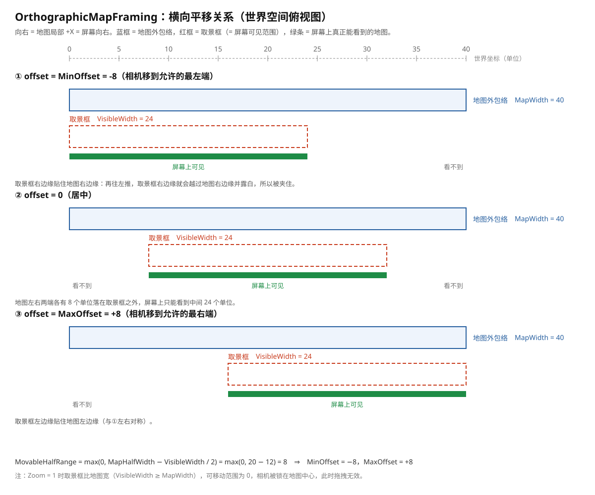
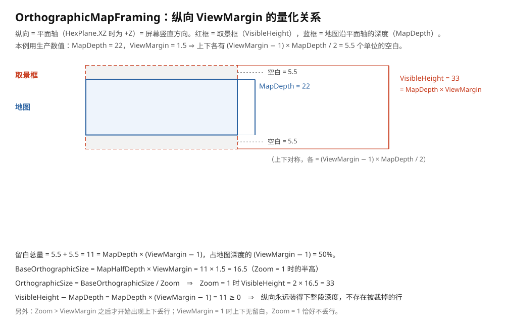

# OrthographicMapFraming 变量示意图

本文用**真实图片**说明 `Assets/Scripts/HexMap/Core/OrthographicMapFraming.cs` 里各个量的含义与关系。
数学推导见 `docs/implementation/orthographic-map-camera-internals.md` 第 3 节；使用方式见 `docs/implementation/orthographic-map-camera.md`。

**轴向约定**：相机在地图上方垂直俯视。

- 横向 = 地图局部 **+X** = 屏幕水平方向，相机**只能沿这个方向平移**；
- 纵向 = 平面轴（`HexPlane.XZ` 为 **+Z**，`HexPlane.XY` 为 **+Y**）= 屏幕竖直方向，**永远不需要平移**。

图中示意取值：横向用 `MapWidth = 40`、`VisibleWidth = 24`（于是单侧可移动 8）；纵向用**生产数值** `MapDepth = 22`、`ViewMargin = 1.5`（于是 `VisibleHeight = 33`，上下各留 5.5）。

---

## 1. 横向平移关系



图上的三段分别对应：

- **蓝框** = 地图外包络的范围，宽 = `MapWidth`（半宽即 `MapHalfWidth`，`MapWidth = 2 × MapHalfWidth`）。它只由布局与地图半径决定，**与 Zoom、Aspect 无关**。
- **红框** = 取景框，也就是**屏幕能看到的范围**，宽 = `VisibleWidth`（派生量：`VisibleWidth = VisibleHeight × Aspect`，没有独立旋钮）。
- **绿条** = 屏幕上真正能看到的那部分地图。

三个 panel 是同一张地图的三个相机位置（地图不动，取景框在滑）：

| panel | offset | 取景框位置 | 结果 |
| --- | --- | --- | --- |
| ① | `MinOffset = -8` | 右边缘贴住地图右边缘 | 地图左侧 8 个单位看不到 |
| ② | `0` | 居中 | 地图左右各 8 个单位看不到 |
| ③ | `MaxOffset = +8` | 左边缘贴住地图左边缘 | 地图右侧 8 个单位看不到 |

要点：

- `offset` 是**相机相对地图中心 `Origin` 的偏移**（正方向 = 地图局部 +X = 屏幕向右），不是地图上的坐标；`MinOffset` / `MaxOffset` 是它的上下限，两者关于 0 对称。
- `MovableHalfRange = max(0, MapHalfWidth − VisibleWidth / 2) = max(0, 20 − 12) = 8`，可移动范围全长 = `MaxOffset − MinOffset` = 16。
- 超出 `MinOffset` / `MaxOffset` 的位置（图中的 ④）会让取景框边缘越过地图边缘、露出没有地图的空白，所以被 `ClampOffset` 夹回范围内。
- `Zoom = 1` 时取景框比地图宽（`VisibleWidth ≥ MapWidth`，此时 `MovableHalfRange = 0`），相机被锁在地图中心，拖拽无效——可移动范围是放大之后才出现的。

**容易混的一点**：屏幕上相机始终正对 `Origin`，画面之所以平移，是"相机在世界里移左 ⇒ 地图在画面里相对右移"。上图画的是世界空间（地图不动、取景框在滑），别读成"地图在屏幕上滑"。

---

## 2. 纵向关系与 ViewMargin



- **红框** = 取景框的高 = `VisibleHeight`；**蓝框** = 地图沿平面轴的深度 = `MapDepth`（半深即 `MapHalfDepth`）。
- 取景框上下各多出一段空白，大小是可算的：

  ```
  单侧空白 = (ViewMargin − 1) × MapDepth / 2
  留白总量 = MapDepth × (ViewMargin − 1)          = VisibleHeight − MapDepth
  ```

  图中 `MapDepth = 22`、`ViewMargin = 1.5` ⇒ 单侧空白 = `0.5 × 22 / 2 = 5.5`，总量 `11`，即 `VisibleHeight = 22 + 11 = 33`。
- 这段留白的来源是：`BaseOrthographicSize = MapHalfDepth × ViewMargin`（Zoom = 1 时的半高），
  `OrthographicSize = BaseOrthographicSize / Zoom`，`VisibleHeight = OrthographicSize × 2`，
  于是 `VisibleHeight − MapDepth = MapDepth × (ViewMargin − 1) ≥ 0`。
- 因为纵向**永远**装得下整段地图深度，所以不存在被裁掉的行，也不存在"上下平移"——`MinOffset` / `MaxOffset` 只描述横向。
- 例外：`Zoom > ViewMargin` 之后才会出现上下丢行（精确阈值是 `Zoom = ViewMargin`；`ViewMargin = 1` 时上下无留白，Zoom = 1 恰好不丢行）。

---

## 3. 各量之间的依赖顺序

按下面的顺序读，可以看清"谁决定谁"：

1. **只取决于地图（与 Zoom / Aspect 无关）**：`MapHalfWidth`、`MapHalfDepth`、`MapWidth = 2 × MapHalfWidth`、`MapDepth = 2 × MapHalfDepth`、`Origin`。
2. **由视图尺寸推导**：`VisibleHeight = 2 × OrthographicSize`，`VisibleWidth = VisibleHeight × Aspect`。
3. **由缩放档位决定**：`OrthographicSize = BaseOrthographicSize / Zoom`，而 `BaseOrthographicSize = MapHalfDepth × ViewMargin` 只取决于地图与视图边距。
4. **由上面两者相减得到**：`MovableHalfRange = max(0, MapHalfWidth − VisibleWidth / 2)`，再得到 `MinOffset` / `MaxOffset`。

一句话：**缩放变 → 可见尺寸变 → 可移动范围变，而地图外包络始终不变。** 另外 `Zoom` 是绝对档位而非倍率，同一个 Zoom 应用两次结果不变（不会累积）。

---

## 4. 变量速查

| 变量 | 公式 / 来源 | 依赖 Zoom？ | 换句话说是 |
| --- | --- | --- | --- |
| `MapHalfWidth` | 中心点阵 X 跨度 + 格子 X 半宽 | 否 | 地图横向半宽 |
| `MapHalfDepth` | 中心点阵平面跨度 + 格子平面半宽 | 否 | 地图纵向半深 |
| `MapWidth` / `MapDepth` | `MapHalfWidth × 2` / `MapHalfDepth × 2` | 否 | 整张地图多宽 / 多深 |
| `Origin` | 布局 `Origin` | 否 | 相机在偏移 0 时停的位置 |
| `ViewMargin` | 入参，≥ `MinimumViewMargin` | 否 | 纵向额外留白比例 |
| `Aspect` | 入参（视口宽高比） | 否 | 决定取景框有多宽 |
| `BaseOrthographicSize` | `MapHalfDepth × ViewMargin` | 否 | Zoom = 1 时的半高（基准） |
| `Zoom` | 入参（绝对档位） | — | 放大倍数 |
| `OrthographicSize` | `BaseOrthographicSize / Zoom` | 是 | `Camera.orthographicSize`（半高） |
| `VisibleHeight` | `OrthographicSize × 2` | 是 | 纵向可见世界高度 |
| `VisibleWidth` | `VisibleHeight × Aspect` | 是 | 横向可见世界宽度（派生，无独立旋钮） |
| `MovableHalfRange` | `max(0, MapHalfWidth − VisibleWidth / 2)` | 是 | 单侧可拖多远 |
| `MinOffset` / `MaxOffset` | `∓ MovableHalfRange` | 是 | 相机偏移的上下限 |
| `IsLockedToCenter` | `MovableHalfRange ≤ 0` | 是 | 拖不动了 |
| `ShowsEveryColumn` | `VisibleWidth ≥ MapWidth` | 是 | 一眼看全横向 |

---

## 5. 图片源文件与再生成

图片是 SVG（纯文本、可缩放），放在 `docs/implementation/assets/orthographic-map-framing/`：

| 文件 | 内容 |
| --- | --- |
| `horizontal-pan.svg` | 横向平移关系（含 ① ② ③ 三个相机位置与刻度尺） |
| `vertical-view-margin.svg` | 纵向关系与 `ViewMargin` 的量化（单侧空白 = `(ViewMargin − 1) × MapDepth / 2`） |

需要改图时直接编辑 SVG 里对应的 `x` / `y` 数值即可（每个元素都带注释性的坐标，容易定位）。
